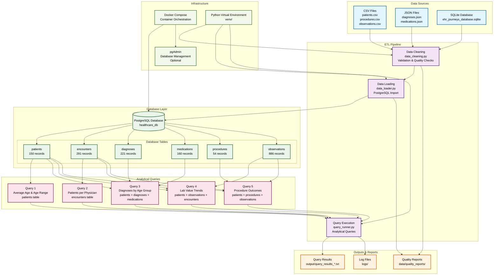
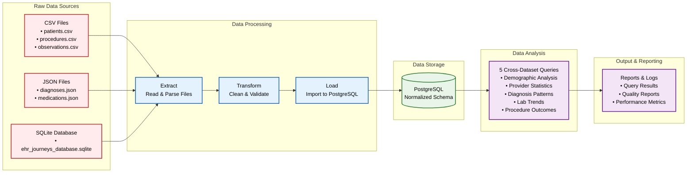
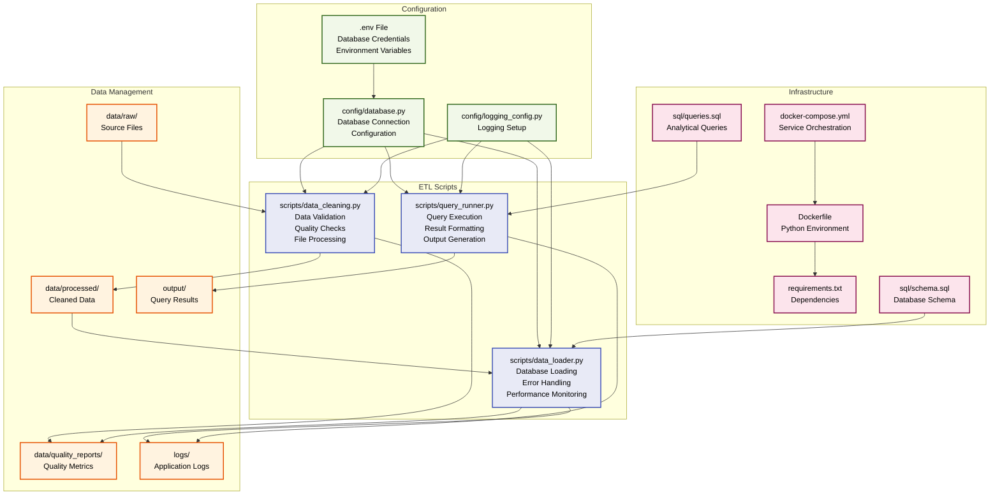
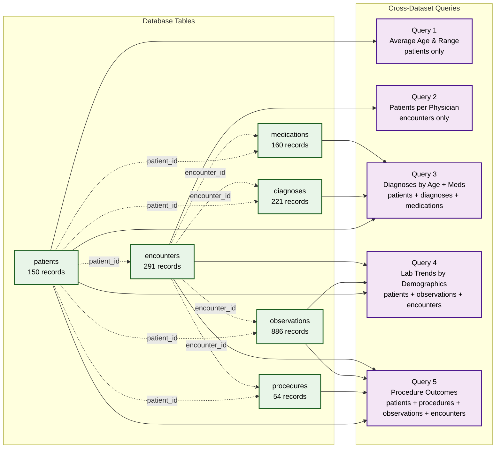

# Healthcare Data Engineering Project - Architecture Diagram

## System Architecture Overview



## Data Flow Architecture



## Component Architecture



## Query Relationships Diagram



## Export Instructions

To export these diagrams in high resolution:

1. **Using Mermaid Live Editor:**
   - Copy each diagram code block to [Mermaid Live Editor](https://mermaid.live/)
   - Click "Download PNG" or "Download SVG" for high-resolution export

2. **Using VS Code:**
   - Install the "Mermaid Preview" extension
   - Open the .md file and use the preview
   - Right-click to save as PNG/SVG

3. **Using Command Line:**
   ```bash
   # Install mermaid-cli
   npm install -g @mermaid-js/mermaid-cli
   
   # Export to PNG
   mmdc -i architecture_diagram.md -o architecture.png -b transparent
   
   # Export to SVG
   mmdc -i architecture_diagram.md -o architecture.svg
   ```

4. **Using Online Tools:**
   - [Mermaid Chart](https://www.mermaidchart.com/)
   - [Draw.io](https://draw.io/) (import Mermaid code)

## Diagram Features

- **Color-coded components** for easy identification
- **Data flow arrows** showing ETL pipeline progression
- **Record counts** for each database table
- **Query relationships** showing which tables each query uses
- **Infrastructure components** including Docker and virtual environment
- **Output locations** for results, logs, and reports
- **Cross-dataset query visualization** showing the 5 analytical queries

The diagrams are designed to be:
- **High resolution** for professional documentation
- **Scalable** (SVG format recommended)
- **Clear and readable** with proper contrast
- **Comprehensive** covering all system components 